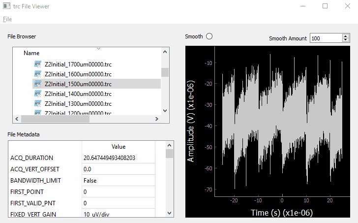

# lecroyviewer

Simple PyQt5 based viewer for Lecroy oscilloscope trc files. 

The program is fairly basic at this point and has been tested with basic time traces from a Lecroy WavePro HD oscilloscope. 

First set a base folder for the navigation tree with 'File-> Open Base Folder'. Then click on a .trc file to view the time plot and metadata. The 'Smooth' Radiobutton can be used to perform a rolling average over a specified window measured in data points. 

## Standalone program

For a standalone executable file download the latest file on the releases page.

## Development and running from python

Install the required packages with `conda env create -f environment.yml`

Then change `BASE_DIR` in `trcviewer.py` to a directory that you want to open in the file browser. Otherwise it will open in the root directory. 

run `python trcviewer.py`

### Building the executable file with pyinstaller 

`pyinstaller --onefile trcviewer.spec`

